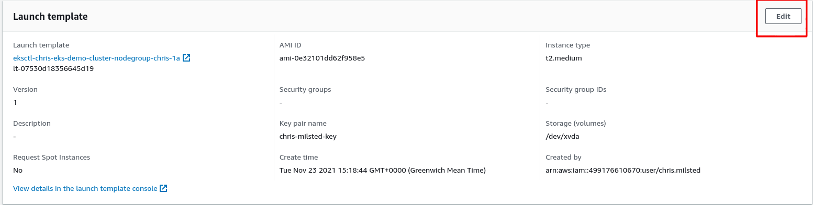
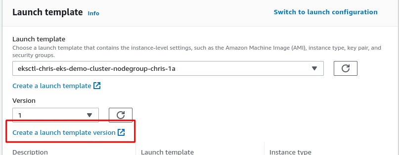
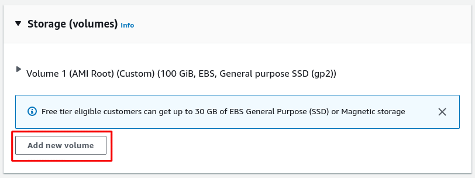
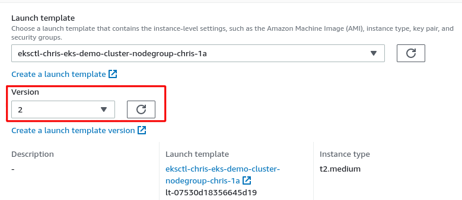
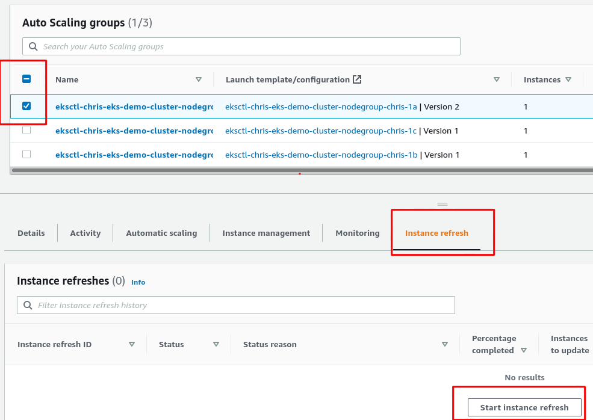
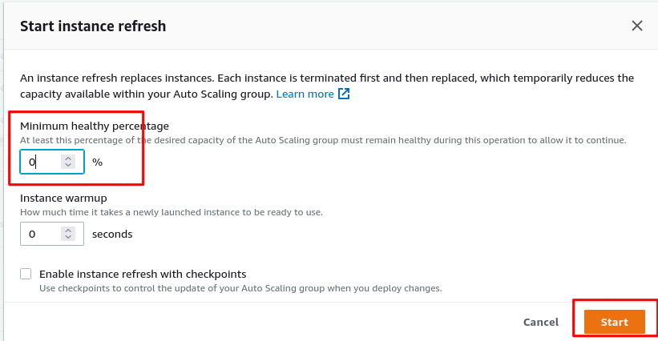

# Demo Building

- [Demo Building](#demo-building)
- [Pre-requisites - Setting Up My Laptop](#pre-requisites---setting-up-my-laptop)
    - [Install `terraform`](#install-terraform)
    - [Install `aws`](#install-aws)
    - [Install `eksctl`](#install-eksctl)
- [Onto Building EKS Clusters](#onto-building-eks-clusters)
    - [Create SSH Keys](#create-ssh-keys)
    - [Using `eksctl`](#using-eksctl)
      - [Manual steps that need automating in the future](#manual-steps-that-need-automating-in-the-future)
    - [Installing OnDat](#installing-ondat)
  - [Creating Topology Awareness In Our Ondat 2.5+ EKS Cluster](#creating-topology-awareness-in-our-ondat-25-eks-cluster)
    - [Running Workloads Ontop Of Our Cluster](#running-workloads-ontop-of-our-cluster)
      - [Using Ondat Feature Labels In Persistent Volume Claims](#using-ondat-feature-labels-in-persistent-volume-claims)
      - [Using Ondat Feature Labels In A Storage Class](#using-ondat-feature-labels-in-a-storage-class)
    - [Accessing Ondat's UI;](#accessing-ondats-ui)
    - [Removal & Deletion](#removal--deletion)
- [Links](#links)
- [Notes](#notes)
    - [Working out what the AZ's are called](#working-out-what-the-azs-are-called)


# Pre-requisites - Setting Up My Laptop

* I am running Fedora 35 currently, so the first steps are to get the utilities onto my machine so that I can talk to AWS via the API using either `eksctl` or Terraform modules to make this simpler.
### Install `terraform` 

* From the link [6] below, I ran the following to install the terraform command:

```bash
# Fedora users.
$ sudo dnf install -y dnf-plugins-core
$ sudo dnf config-manager --add-repo https://rpm.releases.hashicorp.com/fedora/hashicorp.repo
$ dnf install terrform

# macOS users.
$ brew install terraform
```

* We can check this has worked with the following:

```bash
$ terraform version
Terraform v1.0.11
on linux_amd64
```

### Install `aws`

*  I am going to use the V2 CLI and follow the installation instructions at [8]:

```bash
# Fedora users.
$ curl "https://awscli.amazonaws.com/awscli-exe-linux-x86_64.zip" -o "awscliv2.zip"
$ unzip awscliv2.zip
$ sudo ./aws/install

# macOS users.
$ brew install awscli
```

* And again we can check this with:

```bash
$ aws --version
aws-cli/2.3.7 Python/3.8.8 Linux/5.14.17-301.fc35.x86_64 exe/x86_64.fedora.35 prompt/off
```

* Configure the `aws` CLI with your AWS account credentials:

```bash
$ aws configure
AWS Access Key ID [None]: YOUR_ACCESS_KEY_ID
AWS Secret Access Key [None]: YOUR_SECRET_ACCESS_KEY
Default region name [None]: YOUR_DEFAULT_AWS_REGION
Default output format [None]: YOUR_DEFAULT_OUTPUT_FORMAT
```

### Install `eksctl` 

* This can be done following the instructions at [7] which are:

```bash
# Fedora users.
$ curl --silent --location "https://github.com/weaveworks/eksctl/releases/latest/download/eksctl_$(uname -s)_amd64.tar.gz" | tar xz -C /tmp
$ sudo mv /tmp/eksctl /usr/local/bin

# macOS users.
$ brew install eksctl
```

* We can test this again with:

```
$ eksctl version
0.73.0
```

# Onto Building EKS Clusters 

### Create SSH Keys

* Create SSH keys for your EC2 instances [10] in the region where you will create the cluster. This will give you the option to SSH into worker nodes.

```bash
# create your key pair.
$ aws ec2 create-key-pair \
    --key-name="key_pair_name" \
    --key-type="ed25519" \
    --region="eu-central-1" \
    --query="KeyMaterial" \
    --output="text" > ~/.ssh/key_pair_name.pem

# change the file permission for your key pair.
$ chmod 400 ~/.ssh/key_pair_name.pem
```

* To get the username for your EC2 instance, review the [official documentation for EC2](https://docs.aws.amazon.com/AWSEC2/latest/UserGuide/connection-prereqs.html#connection-prereqs-get-info-about-instance).

### Using `eksctl`

* The first thing I want to try out is the `eksctl` command to spin up a cluster. By default, this will make some assumptions about region, images to use and other parameters. I want to override these and use a specified region and also use the bottlerocket or Amazon Linux 2 images as these already container the right modules loaded in the Linux kernel to provide Linux IO.

* Rather than come up with a massive set of command line arguments, you can also declaratively define your cluster in a YAML ClusterConfig for the `eksctl` command. The one I defined is here:
  * [eks-demo-chris.yaml](./eks-demo-chris.yaml)

* Make a copy of `eks-demo-chris.yaml` and make changes to the key value pairs in the configuration file to what you prefer; 
  * i.e.,
    * [`metadata.name`]
    * [`metadata.region`]
    * [`nodeGroups.amiFamily`]
    * [`nodeGroups.ssh.allow`]
    * [`nodeGroups.ssh.allow.publicKeyName`]

```bash
$ cp eks-demo-chris.yaml eks-demo-username.yaml
$ vim eks-demo-username.yaml
```

* We can now run the command as follows (note the `kubeconfig` flag to specify a unique kubeconfig file to write):

```bash
# create the EKS cluster with your custom configuration file and 
# store the cluster kubeconfig file under `~/.kube/eksctl/clusters`.
$ eksctl create cluster --config-file=eks-demo-username.yaml --auto-kubeconfig
```

* Now go and get a cup of coffee, this takes a while (almost one hour for me for some reason). The final message should be similar to:

```bash 
2021-11-18 16:26:06 [✔]  EKS cluster "chris-eks-demo-cluster" in "eu-central-1" region is ready
```

* We can check that the cluster is up and running a simple kubectl command:

```bash 
# obtain your cluster credentials.
$ eksctl utils write-kubeconfig --cluster=eks-demo-username-cluster --region=eu-central-1

# inspect the pods of your newly provisioned cluster.
$ kubectl get pods -A
NAMESPACE     NAME                       READY   STATUS    RESTARTS   AGE
kube-system   aws-node-45ndt             1/1     Running   0          2m34s
kube-system   aws-node-775nd             1/1     Running   0          4m38s
kube-system   aws-node-qr67w             1/1     Running   0          3m46s
kube-system   coredns-745979c988-vkjnk   1/1     Running   0          44m
kube-system   coredns-745979c988-z8xlt   1/1     Running   0          44m
kube-system   kube-proxy-ktg54           1/1     Running   0          4m38s
kube-system   kube-proxy-wfw4p           1/1     Running   0          2m34s
kube-system   kube-proxy-zwx4c           1/1     Running   0          3m46s
```

#### Manual steps that need automating in the future

1. I want to add a new disk to the nodes - so I am going to manually alter the launch template to add a new disk
2. I then want to re-deploy the nodes (set the instance refresh with a 0% health replacement)
3. Then I want to format with ext4 and mount the new disk at /var/lib/storageos (will put it as a dev1 etc in the future).

It seems very difficult to do this with `eksctl`. I can either have a launch template with a managed node pool, but then I do not see to be able to set ssh allow:true. Or I can have a simple self-managed node pool (which makes more sense for a stateful storage set of nodes anyway) but I do not seem to be able to then specify a launch template with this to create more disks. I suspect that I may need to move this to terraform longer term, but so far my terraform file is about 140 lines long and still not complete with things like IAM roles and CSI/CNI plugins that `eksctl` provides.

Manual steps I am currently following:

1. Head to [auto scaling groups](https://console.aws.amazon.com/ec2autoscaling) landing page, you should see three autoscaling groups which have been created, one for each of the node pools in the different availability zones.
2. For each of these repeat the following.
3. Click on the first auto-scaling group and in the launch template section click edit 

4. Select to create a new launch template version.

5. Scroll down to the EBS volume section and select to add a volume.

6. Fill in the values needed, for me I used

| Field                 | Value                 |
| ---                   | ---                   |
| Device Name           | /dev/xvdb             |
| Snasphot info         | Do not include        |
| Size                  | 100 GiB               |
| Volume Type           | gp2                   |
| IOPS info             | Leave blank           |
| Delete on Termination | Yes                   |
| Encryption            | Dont include          |
| Key                   | Dont include          |

7. Now go back through steps 1, 2, 3 and 4 but instead of clicking to create a new launch template version, we are going to update the ASG to use the new template using the dropdown and select the new version 2 we just created. Click update at the bottom to confirm this change.

8. Select to start an instance refresh to re-deploy our instances with our new template. Select out ASG and then select the instance refresh tab and then click "start instance refresh".

9. Change the minimum healthy to 0% to kick this off immediately

10. Now repeat this for the next two AZ's...

The next step, again which if we could specify user data and a custom set of commands to be run in a launch template, is to setup the second volume as the storageOS data volume for this testing so we can get stats for this volume as we do the testing.

The script we want to run on all of the nodes is:
  * [filesystem.sh](./filesystem.sh)

```bash 
#!/bin/bash
mkfs -t ext4 /dev/xvdb
mkdir -p /var/lib/storageos/data
mount /dev/xvdb /var/lib/storageos/data
```

As we specified ssh access with the `eksctl` command we can just ssh to the nodes and run this using `ssh ec2-user@<public_ip_address>` as we also injected out public ssh key.

On all three worker nodes login and run the above commands which should end up with a result as:

```bash
# mount |grep xvdb
/dev/xvdb on /var/lib/storageos type ext4 (rw,relatime)
```

This completes the node setup and we can move onto installing OnDat...

### Installing OnDat

* Assuming that you have the `kubeconfig` populated from the above command, if not you can always retrieve this using:

```bash
# obtain your cluster credentials.
$ eksctl utils write-kubeconfig --cluster=eks-demo-username-cluster --region=eu-central-1
```
* Either use this in your `~/.kube/config` file or `export KUBECONFIG=pathtofile` as you would do normally.

* I am going to be using 2.5+ of OnDat - the installation will be done with the [`kubectl-storageos`](https://github.com/storageos/kubectl-storageos) plugin. This will automate the installation of OnDat and also create the local etcd cluster.
* I am going to also let the operator install an etcd cluster using the new etcd operator, which is based on the improbable engineering project. 
* If you recall above as well I also enabled EBS storage in the cluster as I need an EBS volume to exist to install etcd before I can then install and start using OnDat volumes as we record the metadata into this etcd database to co-ordinate locks and our distributed systems.

* The command to install Ondat into my cluster, will be:

```bash
# check that the plugin is in your path.
$ kubectl storageos help

# run a preflight check.
$ kubectl storageos preflight

# install ondat.
$ kubectl storageos install --include-etcd --etcd-storage-class "gp2" --admin-username "admin" --admin-password "hamster-capacitor-nailgun" --stos-version v2.5.0-beta.5
```

* You can see if this has been successful again with checking the pods:

```bash
$ kubectl get pods -A
NAMESPACE        NAME                                                 READY   STATUS    RESTARTS   AGE
...[SNIP]
storageos-etcd   storageos-etcd-0-8gwx5                               1/1     Running   0          4m
storageos-etcd   storageos-etcd-1-hpqn9                               1/1     Running   0          4m
storageos-etcd   storageos-etcd-2-hxg5x                               1/1     Running   0          4m
storageos-etcd   storageos-etcd-controller-manager-7c6df47dfb-h8chm   1/1     Running   0          4m17s
storageos-etcd   storageos-etcd-proxy-64cf4f6556-8r7c6                1/1     Running   0          4m17s
storageos        storageos-api-manager-85c7c7ff79-vdpl8               1/1     Running   0          2m44s
storageos        storageos-api-manager-85c7c7ff79-xhfqd               1/1     Running   0          2m44s
storageos        storageos-csi-helper-65dc8ff9d8-49cgz                3/3     Running   0          2m44s
storageos        storageos-node-4tjcn                                 3/3     Running   1          3m39s
storageos        storageos-node-66l59                                 3/3     Running   1          3m39s
storageos        storageos-node-tpx48                                 3/3     Running   1          3m39s
storageos        storageos-operator-56bf9d4db7-prkxm                  2/2     Running   0          4m16s
storageos        storageos-scheduler-f954cdbc5-m5w4z                  1/1     Running   0          3m46s
```

## Creating Topology Awareness In Our Ondat 2.5+ EKS Cluster

* From the docs, you are able to apply your own labels or the [Topology Aware Placement (TAP)](https://docs.ondat.io/v2.5/docs/operations/tap/) will look for the default k8s labels which are already set on this cluster:

```bash
$ kubectl get nodes -o yaml |grep zone
      failure-domain.beta.kubernetes.io/zone: eu-central-1a
      topology.kubernetes.io/zone: eu-central-1a
      failure-domain.beta.kubernetes.io/zone: eu-central-1b
      topology.kubernetes.io/zone: eu-central-1b
      failure-domain.beta.kubernetes.io/zone: eu-central-1c
      topology.kubernetes.io/zone: eu-central-1c
```

* Here you can see that the topology zone flags are set on the nodes for OnDat to use. 
* Rather than set the feature flags on a per PVC level, we are now also going to define a new storage class which will set replication, encryption and TAP so that we can build a secure, replicated production ready storage layer on top of this k8s cluster using OnDat:

```yaml
apiVersion: storage.k8s.io/v1
kind: StorageClass
metadata:
  name: storageos-rep-enc-tap
provisioner: csi.storageos.com
allowVolumeExpansion: true
parameters:
  csi.storage.k8s.io/fstype: ext4
  storageos.com/replicas: "2"
  storageos.com/encryption: "true"
  storageos.com/topology-aware: "true"
  csi.storage.k8s.io/secret-name: storageos-api
  csi.storage.k8s.io/secret-namespace: storageos
```

* Save the above to a file and use `kubectl apply -f <filename>` to apply it to your cluster to make a new storage class of `storageos-rep-enc-tap`.
* You can check this by running `kubectl get sc` and you should see this in the output.
  * You can also find examples of custom storage classes in [storage-classes/](./storage-classes/);

```bash
# create storage classes.
$ kubectl apply -f storage-classes/

# inspect the storage classes that have been created.
$ kubectl get sc
```

* Last step - rather than having to specify the storage class for deployments, I am going to make it so that the cluster uses the new `rep-enc-tap` storage class as the default using:

```bash
# make `gp2` storage class non default.
$ kubectl patch storageclass gp2 -p '{"metadata": {"annotations":{"storageclass.kubernetes.io/is-default-class":"false"}}}'

# make `storageos-rep-enc-tap` storage class default.
$ kubectl patch storageclass storageos-rep-enc-tap -p '{"metadata": {"annotations":{"storageclass.kubernetes.io/is-default-class":"true"}}}'

# inspect the storage classes for the new changes applied.
$ kubectl get sc
```

### Running Workloads Ontop Of Our Cluster

#### Using Ondat Feature Labels In Persistent Volume Claims

* You can find examples of persistent volume claims and pod manifests that are using Ondat feature labels to enable useful capabilities in [pvc/](./pvc/);


```bash
# create the PVCs and Pod manifests in this directory.
$ kubectl apply -f pvc/

# inspect the pods that have been created in the default namespace.
$ kubectl get pods --all-namespaces

# inspect the PVCs created.
$ kubectl get pvc --all-namespaces
$ kubectl describe pvc --all-namespaces
```

#### Using Ondat Feature Labels In A Storage Class

* I am looking to build a Database as a Service (DBaaS) on top of https://github.com/CrunchyData/postgres-operator

* First, we will use https://github.com/CrunchyData/postgres-operator-examples and install Postgres Operator from Crunchy Data using the following commands below;

```bash
# clone the repository.
$ git clone https://github.com/CrunchyData/postgres-operator-examples

# install the postgres operator.
$ kubectl apply -k kustomize/install

# inspect the operator status to ensure that it is running.
$ kubectl get pods,deployments --namespace=postgres-operator

# navigate into `sa-demo-ondat/postgres/`, review `pg-databases.yml` 
# and then create 10 postgres clusters named `hippo[N]` in 
# the `postgres-operator` namespace.
$ cd sa-demo-ondat/postgres/
$ cat pg-databases.yml

$ kubectl apply -f pg-databases.yml
postgrescluster.postgres-operator.crunchydata.com/hippo1 created
postgrescluster.postgres-operator.crunchydata.com/hippo2 created
postgrescluster.postgres-operator.crunchydata.com/hippo3 created
postgrescluster.postgres-operator.crunchydata.com/hippo4 created
postgrescluster.postgres-operator.crunchydata.com/hippo5 created
postgrescluster.postgres-operator.crunchydata.com/hippo6 created
postgrescluster.postgres-operator.crunchydata.com/hippo7 created
postgrescluster.postgres-operator.crunchydata.com/hippo8 created
postgrescluster.postgres-operator.crunchydata.com/hippo9 created
postgrescluster.postgres-operator.crunchydata.com/hippo10 created

# inspect and track the progress of the postgres clusters being created.
$ kubectl describe postgresclusters.postgres-operator.crunchydata.com hippo --namespace=postgres-operator 
$ kubectl get pods --namespace=postgres-operator
$ kubectl get pvc --namespace=postgres-operator
$ kubectl get pv | grep "postgres-operator"
```

* Once the postgres clusters are now up and running, we will now connect an application > `keycloak` to our postgres clusters.

```bash
# navigate into `sa-demo-ondat/postgres/`, review `keycloak-apps-postgres.yml` 
# and then create 10 keycloak instances named `keycloak[N]` in 
# the `postgres-operator` namespace.
$ cd sa-demo-ondat/postgres/
$ cat keycloak-apps-postgres.yml

$ kubectl apply -f keycloak-apps-postgres.yml
deployment.apps/keycloak1 created
deployment.apps/keycloak2 created
deployment.apps/keycloak3 created
deployment.apps/keycloak4 created
deployment.apps/keycloak5 created
deployment.apps/keycloak6 created
deployment.apps/keycloak7 created
deployment.apps/keycloak8 created
deployment.apps/keycloak9 created
deployment.apps/keycloak10 created

# inspect and track the progress of the postgres clusters being created.
$ kubectl get pods --namespace=postgres-operator
```

### Accessing Ondat's UI;

* Use Ondat's UI to review the status of the cluster and the volumes.

```bash
# use port forwarding to access Ondat's UI.
$ kubectl port-forward service/storageos 5705 --namespace=storageos

# login to Ondat's UI using your preferred browser.
http://localhost:5705/
```

### Removal & Deletion

* You will need to remove the workloads that are using Ondat's StorageClasses first before you remove Ondat from your EKS Cluster. 

```bash
# delete the example workloads deployed in your cluster
$ kubectl delete -f pvc/
$ kubectl delete -f postgres/keycloak-apps-postgres.yml
$ kubectl delete -f postgres/pg-databases.yml
$ kubectl delete -k postgres-operator-examples/kustomize/install/

# remove Ondat from the cluster.
$ kubectl storageos uninstall --include-etcd
Skip namespace deletion [y/N]: n
Discovered StorageOS cluster and operator version v2.5.0-beta.8...
resourcequota "storageos-critical-pods" deleted
# ...truncated output

# destroy the environment created with `eksctl` once you 
# are finished testing out EKS & Ondat.
$ eksctl delete cluster --region=eu-central-1 --name=eks-demo-username-cluster
```

* *NOTE* The volumes are not deleted for some reason.

# Links

[1] https://github.com/terraform-aws-modules/terraform-aws-eks/blob/master/docs/iam-permissions.md

[2] https://learnk8s.io/terraform-eks

[3] https://docs.aws.amazon.com/AWSEC2/latest/UserGuide/ebs-volume-types.html

[4] https://learn.hashicorp.com/collections/terraform/aws-get-started

[5] https://registry.terraform.io/providers/hashicorp/aws/latest/docs/resources/eks_cluster

[6] https://www.terraform.io/docs/cli/install/yum.html

[7] https://github.com/weaveworks/eksctl

[8] https://docs.aws.amazon.com/cli/latest/userguide/getting-started-install.html

[9] https://docs.aws.amazon.com/eks/latest/userguide/launch-node-bottlerocket.html

[10] https://docs.aws.amazon.com/AWSEC2/latest/UserGuide/ec2-key-pairs.html#having-ec2-create-your-key-pair

[11] https://access.crunchydata.com/documentation/postgres-operator/v5/quickstart/

# Notes 

### Working out what the AZ's are called

```bash
$ aws ec2 describe-availability-zones --region eu-central-1
{
    "AvailabilityZones": [
        {
            "State": "available",
            "OptInStatus": "opt-in-not-required",
            "Messages": [],
            "RegionName": "eu-central-1",
            "ZoneName": "eu-central-1a",
            "ZoneId": "euc1-az2",
            "GroupName": "eu-central-1",
            "NetworkBorderGroup": "eu-central-1",
            "ZoneType": "availability-zone"
        },
        {
            "State": "available",
            "OptInStatus": "opt-in-not-required",
            "Messages": [],
            "RegionName": "eu-central-1",
            "ZoneName": "eu-central-1b",
            "ZoneId": "euc1-az3",
            "GroupName": "eu-central-1",
            "NetworkBorderGroup": "eu-central-1",
            "ZoneType": "availability-zone"
        },
        {
            "State": "available",
            "OptInStatus": "opt-in-not-required",
            "Messages": [],
            "RegionName": "eu-central-1",
            "ZoneName": "eu-central-1c",
            "ZoneId": "euc1-az1",
            "GroupName": "eu-central-1",
            "NetworkBorderGroup": "eu-central-1",
            "ZoneType": "availability-zone"
        }
    ]
}
```

```bash
Content-Type: multipart/mixed; boundary="==BOUNDARY=="
MIME-Version: 1.0

--==BOUNDARY==
Content-Type: text/x-shellscript; charset="us-ascii"

#!/bin/bash
mkfs -t ext4 /dev/sda
mkdir -p /var/lib/storageos/data
mount /dev/sda /var/lib/storageos/data

--==BOUNDARY==--
```bash